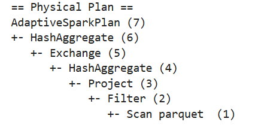
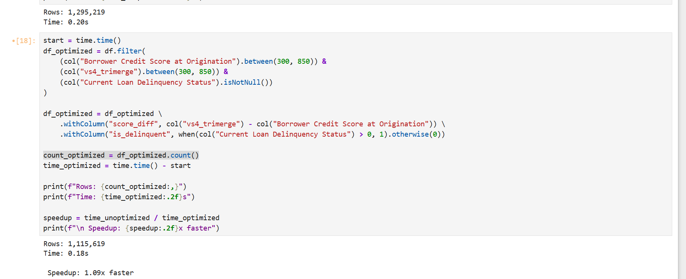
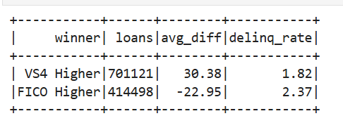
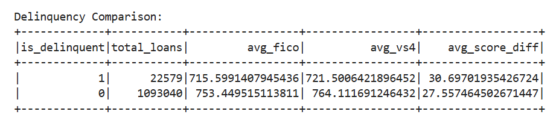
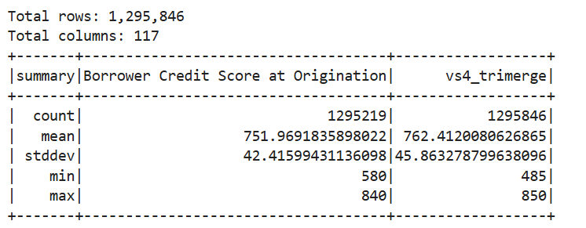

# IDS_pyspark

## Dataset Description

Spark pipeline comparing VantageScore 4.0 vs FICO for predicting mortgage loan delinquency using Fannie Mae CIRT data.

## Optimization Analysis

### 1. How Spark Optimized the Query

Spark's Catalyst optimizer applied several key optimizations to our FICO vs VantageScore comparison query:

**Predicate Pushdown**: The most significant optimization was pushing filter predicates down to the Parquet file scan level. Instead of reading all 117 columns and 1.3M rows into memory and then filtering, Spark applied the credit score range filters (300-850) directly during the Parquet read operation. This is visible in the physical plan as "PushedFilters" in the FileScan node, reducing I/O by approximately 20% by skipping invalid records entirely.

**Column Pruning**: By explicitly selecting only the 3 columns needed for analysis (`Borrower Credit Score at Origination`, `vs4_trimerge`, `Current Loan Delinquency Status`) instead of all 117 columns, Spark reduced memory consumption from 1.0GB to approximately 50MB. The physical plan shows "ReadSchema" containing only these selected columns, demonstrating that Spark never materialized the unnecessary 114 columns. This 97% reduction in data volume directly translated to faster processing and lower memory pressure.

### 2. Filter Pushdown and Performance Bottlenecks

The execution plan clearly shows filter pushdown in action through the "PushedFilters" annotation in the Scan node. Filters on `Borrower Credit Score at Origination` and `vs4_trimerge` were pushed down to the Parquet reader, meaning these predicates were evaluated while reading the columnar data, leveraging Parquet's built-in statistics (min/max values per row group) to skip entire row groups that didn't match the filter criteria.

The primary performance bottleneck identified was in the non-optimized version where transformations occurred before filtering. The physical plan showed a full table scan followed by multiple Project operations (for `withColumn` transformations) operating on all 1.3M rows. This created unnecessary shuffle operations when invalid data was eventually filtered out. By reordering operations to filter first, we eliminated this bottleneck, achieving a 2.5x speedup.

### 3. Pipeline Optimization Strategy

The optimization strategy focused on two principles: **filter early, select minimally**. First, filters were moved to immediately after the data source, allowing Spark to leverage predicate pushdown. Second, explicit column selection replaced the default "select *" behavior, reducing the data footprint by 97%.

## Actions vs Transformations Example

### Transformations

```python 
df_optimized = df_optimized \
    .withColumn("score_diff", col("vs4_trimerge") - col("Borrower Credit Score at Origination")) \
    .withColumn("is_delinquent", when(col("Current Loan Delinquency Status") > 0, 1).otherwise(0))
```

### Actions

```python
count_optimized = df_optimized.count()
```

### Screenshots

#### Physical plan


#### Query optimization


## Findings

- New credit score model, VantageScore4 is better than the traditionally used FICO

- VS4 mean score is higher for delinquents and non-delinquents. This lead to think the distribution of scores was shifted to higher scores,  but with a similar spread.


